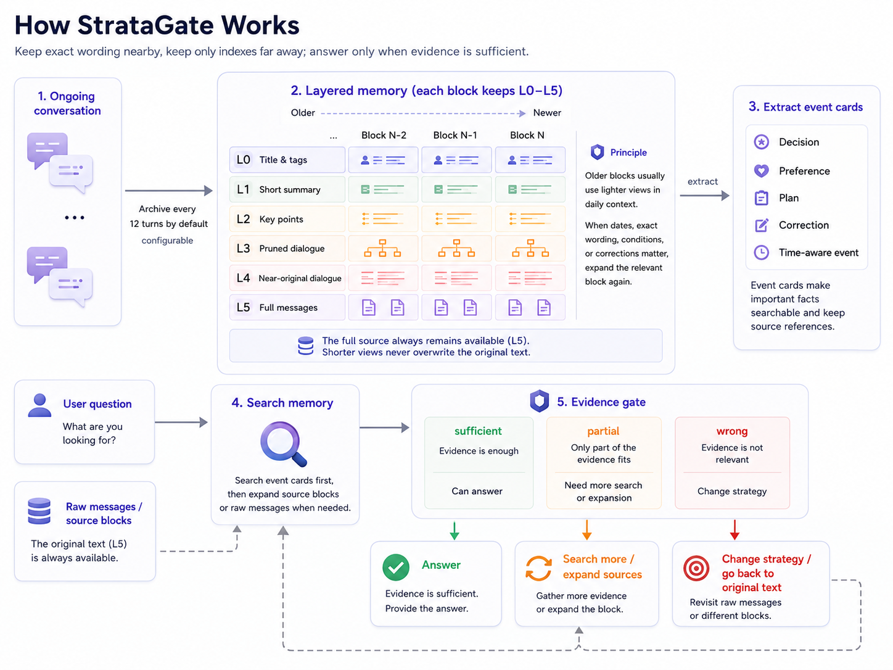

<div align="center">


# StrataGate

### Recent conversations stay verbatim. Older ones become an index. Answers wait for enough evidence.

A layered memory and evidence retrieval system for long-running AI agents.

[](https://github.com/diqierjia/StrataGate/actions/workflows/ci.yml)
[](LICENSE)
[](https://www.typescriptlang.org/)

[中文说明](README.zh-CN.md) · [Architecture](docs/ARCHITECTURE.md) · [Full evaluation](docs/EVALUATION.md)

**LoCoMo `conv-26`: StrataGate 73.03% · Mem0 base 63.16%**

**Temporal questions: 61.35% · 34.59% (+26.76 percentage points)**

</div>

## Results

On the 152 category 1–4 questions from LoCoMo `conv-26`, StrataGate answered **111 / 152** correctly by majority vote, compared with **96 / 152** for Mem0 base.

| Metric | StrataGate | Mem0 base | Difference |
| --- | ---: | ---: | ---: |
| Majority-vote accuracy | **73.03%** | 63.16% | **+9.87** |
| Ten-Judge mean accuracy | **71.97%** | 63.22% | **+8.75** |
| Single-hop | **79.29%** | 75.14% | +4.14 |
| Multi-hop | **63.44%** | 61.56% | +1.88 |
| Temporal | **61.35%** | 34.59% | **+26.76** |
| Open-domain | 83.85% | **84.62%** | -0.77 |

The largest gap appears in temporal questions. StrataGate stores when an event happened separately from when it was mentioned, and falls back to the raw messages when an event card lacks the necessary detail.

This comparison uses the same question set and order, GPT-5.6 Sol as the answer model and Judge, the same Judge prompt, and ten independent judgments per question. StrataGate reused an existing memory state, while Mem0 rebuilt its memory in this run. See the [evaluation record](docs/EVALUATION.md) for the complete protocol matrix.

### 🎯 Better retrieval does not mean more retrieval

On the same StrataGate memory state:

| Downstream model protocol | Majority vote | Average retrieval rounds |
| --- | ---: | ---: |
| GPT-4o-mini | 74 / 152 (48.68%) | 2.7039 |
| GPT-5.6 Sol | **111 / 152 (73.03%)** | **1.7961** |

With fewer retrieval rounds, the Sol run recovered 40 of the 51 questions that had regressed in round six. Choosing the right strategy matters more than simply searching more often.

### 🪶 More complex internal state performed worse

| Retrieval control | Correct | Accuracy |
| --- | ---: | ---: |
| Five-field evidence gate | **118 / 152** | **77.63%** |
| More complex structured retrieval note | 97 / 152 | 63.82% |

This regression shaped the current evidence gate: few fields, bounded length, an explicit next action, and a structure that code can enforce.

## Core strengths

| Layered memory | Temporal memory | Evidence gate |
| --- | --- | --- |
| Each conversation block keeps six levels of detail from L0 to L5. Older blocks are shown at a shallower level, with the original available on demand. | Event time is stored separately from mention time, with support for plans, cancellations, ranges, and corrections. | Relevant results are checked for sufficiency before answering. If evidence is incomplete, the system searches again, expands an event, or returns to the raw source. |

StrataGate also separates a search hit from actual use in an answer. Only memories that genuinely support the answer are reinforced, preventing retrieval results from repeatedly reinforcing themselves.

## Workflow



Conversations are first sealed into layered memory blocks. Information worth finding later becomes an event card. When a question arrives, StrataGate searches first; if the evidence is incomplete, it changes strategy or returns to the raw source until the evidence gate passes.

> **Memory has depth. Answers have a threshold.**

## A real retrieval path

In a question about the date of Caroline's school speech:

```text
Event card matches "school speech"
        ↓
The event is relevant, but the date is missing
verdict = partial
        ↓
Search the raw messages
        ↓
Find "last week" in the message dated 2023-06-09
        ↓
verdict = sufficient
        ↓
Answer
```

The event card provides fast location, the raw message provides final verification, and the evidence gate prevents incomplete evidence from reaching the answer.

## Core design

### 🪜 Layered memory blocks

By default, each set of 12 complete conversation turns is sealed into one memory block.

| Level | Contents | Purpose |
| --- | --- | --- |
| L0 | Title and tags | Index for older memories |
| L1 | Short summary | Quick overview of the topic |
| L2 | Key points | Compact facts |
| L3 | Rule-pruned conversation | Remove narrowly defined redundancy |
| L4 | Readable near-verbatim conversation | Verify natural-language context |
| L5 | Complete messages and tool records | Final source |

New blocks start at L5 and display progressively shallower layers as the conversation advances. L0–L4 are different views of the same source; the complete L5 record is always preserved.

### 🗓️ Event cards

Decisions, preferences, plans, corrections, and temporal events are organized into searchable event cards. Every card retains its source block and source messages, and records:

- `mentionedAt`: when the event was mentioned in the conversation;
- `happenedStart` / `happenedEnd`: when the event actually occurred;
- participants, event type, status, corrections, and conflict relationships.

### 🚦 Evidence gate

Every new batch of retrieval results produces five short fields:

```text
verdict · evidence_refs · fit · missing · next_strategy
```

The system proceeds to an answer only when the evidence comes from the latest retrieval results, `verdict=sufficient`, and `next_strategy=answer`. A `partial` or `wrong` verdict triggers another search, event expansion, or a return to the raw messages.

### 🌱 Reinforce only after actual use

Search updates only the retrieval record. The system calls `recordMemoryUse()` to update long-term weight only after an event card is genuinely used in an answer.

A new event may supersede an old one, but the old source remains traceable. Forgetting removes an event from search while preserving the source chain.

## Evaluation

The evaluation document includes:

- the R1–R5 design iterations;
- GPT-4o-mini and GPT-5.6 Sol model-sensitivity experiments;
- the paired StrataGate and Mem0 base result;
- category scores, question-level differences, and real retrieval paths;
- Judge settings, model audits, retries, tokens, costs, and artifact hashes.

See [`docs/EVALUATION.md`](docs/EVALUATION.md).

## Next steps

- freeze an end-to-end protocol for the full LoCoMo dataset;
- rebuild the StrataGate memory state with GPT-5.6 Sol;
- run ablations on temporal fields, event cards, and raw-message fallback;
- complete a reproducible clean Mem0 run;
- expand storage adapters and retrieval implementations.

## Repository layout

```text
src/
  blocks.ts       Conversation-block layering and decay
  retrieval.ts    Evidence-gate contract
  store.ts        In-memory reference implementation
  types.ts        Data structures and model-adapter interfaces
  weights.ts      Memory adoption and weighting rules

tests/            Core rule tests
examples/         Minimal integration example
docs/             Architecture and evaluation documents
benchmarks/       Experiment records and machine-readable results
```

## License

StrataGate is available under the [MIT License](LICENSE).
