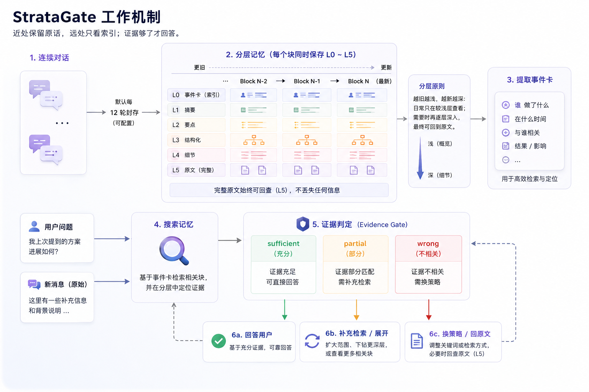

<div align="center">


# StrataGate

### 保留原始证据的长期记忆。

StrataGate 让长期运行的 AI Agent 跨会话记住信息，同时避免把每条记忆都当成不需要核对的事实。

[](https://github.com/diqierjia/StrataGate-AgentMemory/actions/workflows/ci.yml)
[](https://www.npmjs.com/package/stratagate-dsh)
[](LICENSE)
[](https://www.typescriptlang.org/)
[](https://awesome-dsh-plugin.com)
[](CONTRIBUTING.zh-CN.md)

[English](README.md) · [DeepSeek Harness 插件说明](docs/DSH.zh-CN.md) · [架构说明](docs/ARCHITECTURE.md) · [完整评测](docs/EVALUATION.md)

<strong>当前公开结果：</strong>在 LoCoMo `conv-26` 上，StrataGate 经过 10 次独立评审的平均准确率为 <strong>80.46%</strong>，Mem0 base 为 <strong>63.22%</strong>。[查看测试范围与方法](#实验结果)。

</div>

> <strong>简单来说：</strong>StrataGate 不仅记住发生了什么，也保留这些记忆来自哪里；Agent 使用记忆前，还要先判断现有证据够不够。

## 为什么选择 StrataGate？

- **自动、本地优先的跨会话记忆。** 主 Agent 已完成的对话和工具结果会自动写入本地 SQLite，不需要另建记忆服务器。→ [快速开始](#quick-start-deepseek-harness)
- **分层保存，上下文不会一直变长。** 最近的对话保留细节，较早的内容逐渐变成简短索引；只有证据不足时才向下展开。→ [分层记忆](#layered-memory)
- **每条事件都带来源和时间。** 长期记忆不仅记录内容，也能说明来自哪段对话，并区分“什么时候提到”和“什么时候发生”。→ [事件卡](#event-cards)
- **用知识图谱表示当前状态。** 带来源的事件可以整理成人物、项目、组织、工具和地点目前的状态。→ [当前状态图谱](#current-state-graph)
- **回答前先检查证据是否够用。** 搜索结果相关，不代表足以回答；Agent 可能需要继续搜索、展开结果或回查原始消息。→ [证据门](#evidence-gate)
- **搜索命中不会自动强化记忆。** 只有最终答案真正采用的证据，才会更新长期权重，避免越常搜到就越容易再次搜到。→ [只强化实际使用的记忆](#use-only-reinforcement)
- **导入其他 AI 的记忆时保留原文。** 结构化记忆可以转换成可追溯的事件，原始导入内容仍会永久保存。→ [外部记忆导入](#external-memory-import)

## 选择适合你的入口

| 使用方式 | 适合谁 | 从哪里开始 |
| --- | --- | --- |
| **DeepSeek Harness 插件** | 希望自动获得本地记忆和可视化记忆界面的 DSH 用户 | [安装 `stratagate-dsh`](#quick-start-deepseek-harness) |
| **TypeScript 核心库** | 正在开发自定义 Agent 或记忆接入的开发者 | [代码入口](#代码入口) |

<a id="quick-start-deepseek-harness"></a>

## 快速开始：DeepSeek Harness

如果已经安装 DeepSeek Harness，请将 StrataGate 添加到你正在使用的 profile：

```bash
dsh plugin --profile web add stratagate-dsh
```

重启该 profile，之后照常使用 DSH 即可。StrataGate 会自动记录主 Agent 已完成的对话，在后台生成可搜索的记忆，并在 **DSH 设置 → StrataGate-AgentMemory** 中提供记忆界面。

数据库默认保存在：

```text
DSH_HOME/stratagate/memory.db
```

移除插件不会删除数据库。截图、配置项、记忆工具和自动记录规则见 [DeepSeek Harness 插件中文说明](docs/DSH.zh-CN.md)。

## 这些设计要解决什么问题

长期运行的 Agent 不只是需要“存下更多内容”，还需要在回答时找回**正确、完整、可核对**的证据。

只保留摘要，容易丢失日期、限定条件和原话；只做相似度检索，可能找到相关内容，却不是问题真正询问的事件；把每次搜索命中都当作有效记忆，还会形成自我强化的检索反馈。

StrataGate 围绕四个核心问题设计长期记忆：

| 常见问题 | StrataGate 的处理方式 |
| --- | --- |
| 历史越来越长，无法全部放入上下文 | 将对话保存为 L0–L5 分层视图，旧记忆默认只显示较浅层级 |
| 摘要遗漏了日期、原话或限定条件 | L5 原始消息始终保留，任何派生记忆都能回到来源 |
| 搜到了相关内容，但证据不足以回答 | 使用证据门判断是否充分；不足时换策略、展开事件或回查原文 |
| 高频检索结果不断强化自身 | 只有真正被答案采用的记忆才会更新长期权重 |

StrataGate 的目标不是让 Agent 每次检索更多，而是让它知道：**当前证据是否足够，以及下一步应该去哪里找。**

## 实验结果

当前公开对比覆盖 LoCoMo `conv-26`：

- 419 条消息；
- 35 个会话；
- category 1–4 的 152 道问题；
- 每道题进行 10 次独立 Judge 评审。

| 指标 | StrataGate | Mem0 base | 差值 |
| --- | ---: | ---: | ---: |
| 10 次评审平均准确率 | **80.46%** | 63.22% | **+17.24 个百分点** |
| 多数票正确 | **121 / 152（79.61%）** | 96 / 152（63.16%） | **+25 题** |
| Temporal | **74.86%** | 34.59% | **+40.27 个百分点** |
| Single-hop | **89.29%** | 75.14% | **+14.14 个百分点** |
| Multi-hop | **66.56%** | 61.56% | +5.00 个百分点 |
| Open-domain | 83.08% | **84.62%** | -1.54 个百分点 |

最大的差距出现在时间类问题。这个结果与 StrataGate 显式保存事件发生时间、保留来源时间戳并支持原文核对的设计一致，但它不是单组件消融实验，不能把全部差距归因于某一个字段或检索步骤。

两边使用相同的问题、顺序、答案模型、Judge 模型、Judge prompt、解析器和重复次数，并且都重新构建了记忆。两边的记忆抽取、检索实现、embedding 和回答上下文不同，因此这里比较的是两个**完整系统配置**。

这只是 `conv-26` 上的一次单会话对比，不代表完整 LoCoMo 成绩。完整协议、逐题结果、Judge 波动和产物哈希见：

- [`docs/EVALUATION.md`](docs/EVALUATION.md)
- [`benchmarks/locomo-conv26-r8-final.json`](benchmarks/locomo-conv26-r8-final.json)

<a id="how-stratagate-works"></a>

## 它如何工作



正常的记忆过程可以分成五步：

1. **先保存来源。** 任何摘要产生之前，已完成的消息和工具结果都会先保存在本地。
2. **生成更小的视图。** StrataGate 会整理出分层摘要、记录“发生了什么”的事件，以及描述当前状态的图谱事实。
3. **先搜索短记录。** Agent 从简短结果开始，只有需要更多细节时，才展开事件、图谱节点或原始 Block。
4. **回答前检查证据。** 证据门判断现有结果是否充分；如果不够，Agent 必须继续搜索或返回原始消息。
5. **只强化真正用过的记忆。** 只有最终答案确实采用的记忆，才会获得长期权重。

例如，用户说“这个项目使用 pnpm”。StrataGate 会保留原始对话，建立一条可以追溯来源的事件，并在以后的对话中用“项目使用 pnpm”这条简短信息提供背景。如果答案依赖原话或当时的讨论，Agent 可以从事件返回原始消息，而不是只相信缩短后的内容。[查看一条完整的检索示例](#一次真实的检索)。

## 核心设计

<a id="layered-memory"></a>

### 1. 分层记忆：压缩视图，不丢来源

默认每 12 轮完整对话封存为一个记忆块。尚未达到边界的消息保留在 open tail 中，不会提前压缩或抽取。

这是核心库的默认值。DeepSeek Harness 插件为了更及时地产生 Event，默认每 6 轮封存一个 Block，并允许用户通过 `blockTurnSize` 自定义。Block 的 age 是它与同一线程中最新已就绪 Block 的距离，因此 open tail 和模型待处理 Block 不会触发衰减；默认 Block 衰减系数为 `0.30`。

每个已封存的块包含六种详细程度：

| 层级 | 内容 | 主要用途 |
| --- | --- | --- |
| L0 | 标题和标签 | 为很久以前的记忆提供轻量索引 |
| L1 | 简短摘要 | 快速判断一段历史是否相关 |
| L2 | 关键事实 | 提供紧凑的事实列表 |
| L3 | 规则化精简对话 | 删除范围明确的冗余，不做自由语义改写 |
| L4 | 接近原文的可读对话 | 核对自然语言上下文和工具结果 |
| L5 | 完整消息和工具记录 | 最终来源 |

Block 到达边界时，StrataGate 会在任何模型调用之前，先原子地保存永久 L5 与确定性生成的 L4、L3。随后 Block 保持模型待处理状态，不能替换原生对话历史，也不参与衰减；只有 L0–L2 校验和 Event 处理完成后才进入就绪状态。随着后续就绪 Block 增加，默认展示层级逐渐变浅；需要更多细节时，可以重新展开。

L0–L4 都是同一份来源的派生视图，不会覆盖或重写 L5。事件卡同样只能引用原始块，不能反向修改来源。

这使 StrataGate 可以同时满足两个目标：

- 旧记忆保持轻量；
- 任何关键结论仍然可以回到原始消息核对。

<a id="event-cards"></a>

### 2. 事件卡：同时保存内容、来源和时间

值得长期查找的决定、偏好、计划、纠正和时间事件会被整理成事件卡。

每张事件卡不仅保存摘要，还会记录：

```ts
{
  sourceBlockId,
  sourceMessageIds,

  mentionedAt,
  happenedStart,
  happenedEnd,

  status,
  participants,
  eventType,

  supersedesEventIds,
  conflictsWithEventIds
}
```

其中：

- `mentionedAt` 表示这件事什么时候在对话中被提到；
- `happenedStart` / `happenedEnd` 表示事情实际发生或预计发生的时间；
- `status` 可以区分已经发生、计划中、已取消或仍在持续的事件；
- `supersedesEventIds` 和 `conflictsWithEventIds` 用于保留纠正和冲突关系。

将“提及时间”和“发生时间”分开，可以避免把消息日期直接当成事件日期，也让系统有条件正确解析“上周”“下个月”等相对时间。

L0–L2 校验完成后，Event 抽取会独立运行，不再等待块 `N+1`。抽取器可以读取前一个 Block 和最近可用的后续就绪 Block 作为上下文，但新增事实和引用必须来自目标块 `N`。

<a id="current-state-graph"></a>

### 3. 当前状态图谱与可审计检索

事件卡保存“发生过什么”。在此基础上，StrataGate 可以把人物、项目、组织、工具和地点的当前状态整理成图谱节点和有方向的关系。DeepSeek Harness 使用这条图谱原生路径。

图谱整理任务会单独保存进度。即使任务失败，也只需重试这一步，不必重新提取已经写入的事件。系统只有在确认事实或关系引用了本批次事件后才会保存，因此每条整理后的结论都能回到来源。状态发生变化时，旧结论会被标记为历史记录，而不是修改原始事件。

`searchEvents()` 会分别按文字、参与者、类型、名称和时间等信息排序，再合并这些结果；`searchGraphNodes()` 则会在名称、别名、标签、状态、事实和关系中进行加权文字搜索。搜索只返回紧凑的相关事实，不会一次塞入整份大记录；如果文字完全不匹配，也不会随意返回候选结果。这些路径使用可复现的文字和结构化信号，不依赖向量或语义检索。

<a id="evidence-gate"></a>

### 4. 证据门：相关不等于充分

普通检索系统通常在返回若干相似结果后，直接把它们交给回答模型。StrataGate 在检索和回答之间增加了一层固定协议：

```text
verdict · evidence_refs · fit · missing · next_strategy
```

每次检索后都要明确回答五个问题：

- 当前证据是 `sufficient`、`partial` 还是 `wrong`；
- 哪些结果真正支持当前判断；
- 证据与问题具体匹配在哪里；
- 还缺少什么；
- 下一步应该回答、继续搜索、展开事件，还是回查原始消息。

只有同时满足以下条件，系统才接受 `sufficient`：

1. 至少一条证据来自当前指定的检索批次；
2. `next_strategy` 明确为 `answer`；
3. 判断使用固定、长度有界的结构，而不是不断增长的私有检索便签。

如果判断为 `partial` 或 `wrong`，系统可以选择：

```text
search_events
expand_event
search_graph
expand_graph_node
search_raw_memory
expand_block
```

证据门不负责替应用完成整个 Agent loop。StrataGate 提供状态、约束和校验，具体模型调用、工具循环和最大检索预算仍由接入方控制。

<a id="use-only-reinforcement"></a>

### 5. 检索和强化分开

一次事件被搜索到，不代表它真的帮助了答案。

因此，搜索只更新可观测的检索记录，不会直接增加记忆权重。回答完成后，应用需要显式调用：

```ts
await memory.recordMemoryUse({ eventIds, elementIds });
```

只有真正被答案采用的事件，或图谱证据背后的来源事件，才会更新长期权重。仍使用旧版元素卡的接入方式也继续受到支持。

这样可以避免一个常见反馈循环：

```text
某条记忆偶然排得靠前
        ↓
被频繁搜索到
        ↓
权重继续增加
        ↓
以后更容易排在前面
```

<a id="external-memory-import"></a>

### 6. 外部 AI 记忆迁移

可以把另一个 AI 的记忆总结直接迁移到 StrataGate。`importExternalMemory()` 将导入拆成固定的五步：

```text
外部 AI 总结
    ↓ extractor：提取候选 Event
    ↓ searchEvents：每个候选只检索现有 Event 的 Top-K
    ↓ decider：ADD / MERGE / SUPERSEDE / CONFLICT / IGNORE
    ↓ 写入新 Event，保留旧 Event 与来源链
    ↓ 仅为新写入的规范 Event 创建图谱投影任务
```

库导出 `EXTERNAL_MEMORY_EXPORT_PROMPT_ZH_CN`、`EXTERNAL_MEMORY_DECIDER_PROMPT_ZH_CN` 和 `externalMemoryJsonExtractor`，可让外部 AI 输出可校验的 `stratagate.external-memory.v2` JSON，再由本地模型从五种处理方式中选择。v2 将记忆性质与内容分类分开；时间字段严格区分“被提及时间”和“实际发生时间”。日期不确定时，系统会省略日期并保留原始说法，不会根据当前日期或聊天顺序猜测。

完整接入示例和提示词说明见 [`docs/EXTERNAL_MEMORY_IMPORT.zh-CN.md`](docs/EXTERNAL_MEMORY_IMPORT.zh-CN.md)。DeepSeek Harness 管理界面会先预览导入，JSON 不合格时使用模型兜底恢复，确定性忽略完全重复项，并让当前模型结合 Top-K 本地匹配选择新增、合并、取代、冲突或忽略。导入分析及逐条进度会持久化，关闭后重新打开页面可继续查看；高置信度判断自动采用，低置信度项可人工选择具体动作；提交后可按批次撤销。

新事件可以取代旧事件，但旧事件及其来源仍然保留。遗忘可以让事件退出搜索，同时不破坏来源链路。

## 一次真实的检索

LoCoMo 中有一道题询问 Caroline 在什么时候进行了学校演讲。

事件卡已经找到了“学校演讲”，但卡片本身没有包含足够的日期信息：

```text
search_events
        ↓
命中“学校演讲”事件卡
        ↓
事件相关，但没有具体日期
verdict = partial
missing = 发生日期
        ↓
search_raw_memory
        ↓
找到 2023-06-09 的原始消息
其中写着 “last week”
        ↓
结合消息时间解析相对日期
verdict = sufficient
        ↓
回答
```

这个过程里：

- 事件卡负责快速定位；
- 来源时间戳和原始消息负责最终核对；
- 证据门阻止系统拿着不完整信息直接回答。

## 这些设计是怎么形成的

当前设计并不是一次性确定的。多轮实验里最有价值的不是轮次编号，而是暴露出的失败模式。

| 发现的问题 | 实验观察 | 最终设计选择 |
| --- | --- | --- |
| 时间信息被压在摘要里，难以准确恢复 | 在早期同口径实验中，引入每块多事件和显式发生时间后，Temporal 从 18.92% 提升到 45.95% | 将提及时间与发生时间分开，并保留原始时间表达和来源消息 |
| Agent 的检索便签越来越大 | 有界五字段证据门取得 77.63%；扩展为更大的结构化检索便签后降至 63.82% | 保持判断结构小、长度有界，并让代码校验关键约束 |
| 证据不足时反复搜索同一批事件卡 | 早期端到端版本有 19 道题至少搜索三次事件卡，只答对 2 道；当前策略在同一批题中答对 15 道，其中 12 道使用原文回查 | 搜索没有新增证据时切换信息通道，而不是继续重复同一种搜索 |

当前端到端版本相较早期版本：

| 指标 | 早期版本 | 当前版本 | 变化 |
| --- | ---: | ---: | ---: |
| 10 次评审平均准确率 | 70.33% | **80.46%** | **+10.13 个百分点** |
| 多数票正确 | 107 / 152 | **121 / 152** | **+14 题** |
| 检索轮数 | 215 | **146** | **-32.1%** |
| 证据判断调用 | 237 | **146** | **-38.4%** |
| 总 Token | 6.69M | **4.09M** | **-38.9%** |

这组结果说明，旧版本中重复事件搜索是一条明确的失败路径；改为在卡片证据不足时回到来源后，准确率和检索效率同时改善。

不过，两次端到端运行之间还修改了软过滤、中英文同义表达匹配、结果结构和重新抽取的记忆状态。因此这是一组有价值的诊断证据，不是原文回查的单变量消融实验。

R1–R8 的完整实验过程、模型与 Judge 变化、逐题迁移和协议边界见 [`docs/EVALUATION.md`](docs/EVALUATION.md)。

## 当前局限与下一步

当前版本仍有 31 道多数票错误题。按最终可观察到的失败阶段划分：

| 失败阶段 | 题数 | 暴露的问题 |
| --- | ---: | --- |
| 没有检索，直接回答错误 | 15 | 时间题、多跳题和列表题有时过早相信模型自身记忆 |
| 证据门判为 `sufficient`，最终答案仍错 | 14 | 相关但不属于目标事件的材料被误判为充分，或列表答案不完整 |
| 到检索上限仍只有 `partial` 证据 | 2 | 确实存在没有找到足够证据的情况，但并非当前主要瓶颈 |

这表明当前的主要问题已经不是“检索轮数不够”，而是系统是否应该发起检索，以及检索到的证据是否真的足以支持完整答案。

下一步将进行：

1. 固定 memory state，分别消融原文回查、软过滤和事实级检索；
2. 向回答模型直接提供 gold evidence，区分检索失败和回答推理失败；
3. 在更多会话上重复同一套配对协议；
4. 最终扩展到完整 LoCoMo 数据集。

## 当前状态

StrataGate 目前是用于验证长期 Agent 记忆设计的研究型原型。

仓库已经实现并验证了：

- 分层对话块及其衰减规则；
- 带来源、时间和冲突关系的事件卡；
- 独立可重试、保留事件来源的知识图谱整理任务；
- 面向事件和图谱节点的 BM25/RRF 检索；
- 保留原始导入内容的外部 AI 记忆迁移；
- 相互隔离的并发检索批次与证据判断；
- 长度有界、可由代码校验的证据门；
- 检索命中与实际采用分离的权重机制；
- 自动化测试、实验记录和机器可读评测结果。

当前公共 API、模型接入方式和评测覆盖仍在迭代，不建议将其视为已经稳定的生产 SDK。

默认实现使用内存状态。仓库也提供可选的 SQLite adapter，用于实验状态持久化、中断恢复和一致性验证；它不会改变核心检索语义，相关约束见 [`docs/ARCHITECTURE.md`](docs/ARCHITECTURE.md)。

## 代码入口

需要 Node.js 22 或更高版本。

在本地检出仓库后，可以运行：

```bash
npm install
npm run check
npm test
npm run build
```

代码与文档的主要入口：

- [`packages/core/examples/basic.ts`](packages/core/examples/basic.ts)：核心引擎最小示例；
- [`packages/core/src/store.ts`](packages/core/src/store.ts)：核心状态、Block/Event/图谱生命周期、导入和检索；
- [`packages/core/src/events.ts`](packages/core/src/events.ts)：统一事件类型；
- [`packages/core/src/elements.ts`](packages/core/src/elements.ts)：校验来源的元素投影与时间视图；
- [`packages/core/src/graph.ts`](packages/core/src/graph.ts)：校验来源的知识图谱整理和状态维护；
- [`packages/core/src/external-memory.ts`](packages/core/src/external-memory.ts)：外部记忆格式、提示词、解析和提取；
- [`packages/core/src/search.ts`](packages/core/src/search.ts)：确定性 BM25 排序和 RRF 融合；
- [`packages/core/src/retrieval.ts`](packages/core/src/retrieval.ts)：证据门规范化与约束校验；
- [`packages/core/src/blocks.ts`](packages/core/src/blocks.ts)：分层规则与确定性精简；
- [`docs/ARCHITECTURE.md`](docs/ARCHITECTURE.md)：完整系统边界与实现不变量；
- [`docs/EVALUATION.md`](docs/EVALUATION.md)：完整实验过程与失败分析。

`packages/core/examples/basic.ts` 用于展示核心接口，而不是完整复现 benchmark 中的 Agent 工具循环。评测所使用的模型调用、工具编排和 Judge 协议见评测文档。

## 文档与复现

| 资源 | 内容 |
| --- | --- |
| [`docs/ARCHITECTURE.md`](docs/ARCHITECTURE.md) | 数据流、分层规则、事件/元素协议、检索、证据门约束、权重和存储不变量 |
| [`docs/EXTERNAL_MEMORY_IMPORT.zh-CN.md`](docs/EXTERNAL_MEMORY_IMPORT.zh-CN.md) | 外部记忆导出格式、导入流程和接入示例 |
| [`docs/EVALUATION.md`](docs/EVALUATION.md) | R1–R8 实验、模型敏感性、Mem0 对比、失败分析和报告边界 |
| [`benchmarks/locomo-conv26-r8-final.json`](benchmarks/locomo-conv26-r8-final.json) | 当前结果、逐阶段统计、运行信息和源产物哈希 |
| [`packages/core/examples/basic.ts`](packages/core/examples/basic.ts) | 最小代码示例 |

## 项目结构

```text
src/                    DeepSeek Harness Host 与 Web client 适配层
tests/                  DeepSeek Harness 集成测试
cordis.patch.yml        根目录 DSH bundle 清单
packages/core/          共享记忆引擎、核心测试和示例
integrations/workbuddy/ WorkBuddy Host Adapter 与 MCP 接入
docs/                   DSH 使用、架构和完整评测文档
benchmarks/             机器可读实验结果
```

## 什么情况下适合使用 StrataGate

如果你同时需要以下多项能力，可以优先考虑 StrataGate：

- 自动记录已完成对话和工具结果，形成**跨会话长期记忆**；
- 使用本地 SQLite 保存记忆，**不需要单独部署记忆服务**；
- 支持项目、会话或全局隔离，而不是把所有记忆混在一起；
- 使用分层 Event 和知识图谱，同时保存“发生过什么”和“当前是什么状态”；
- 召回结果可以展开回原始对话与工具输出，**来源可追溯**；
- 在把记忆用于回答前，通过**证据充分性检查**判断当前材料是否真的够用。

如果你最需要的是自由编辑记忆内容、跨产品的云端多人协作，或者只想维护一个简单的手写便签文件，应先考虑其他插件。StrataGate 已提供以查看和追溯为主的知识图谱界面，但它更适合自动、本地、证据可追溯的 Agent 记忆工作流，而不是多人知识库编辑。

DeepSeek Harness 用户可以从[快速开始](#quick-start-deepseek-harness)安装。DSH 适配层的行为、工具、配置和失败恢复方式见 [DeepSeek Harness 插件中文文档](docs/DSH.zh-CN.md)。

## 参与贡献

欢迎各种形式的贡献：修复问题、完善文档、增加集成，或探索更好的记忆与检索方案都可以。

请先阅读 [`CONTRIBUTING.zh-CN.md`](CONTRIBUTING.zh-CN.md)，其中包含 monorepo 开发环境、检查与测试命令、适合参与的方向，以及提交 Pull Request 的建议。如果还不确定一个想法是否适合项目，建议先[创建 Issue](https://github.com/diqierjia/StrataGate-AgentMemory/issues)，再投入较大的改动。

## 许可证

StrataGate 使用 [MIT License](LICENSE)。
