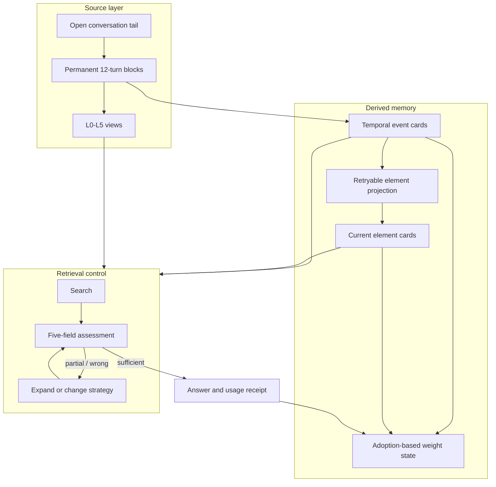

# StrataGate architecture

实施路线与阶段验收见：[优化总体计划](OPTIMIZATION_PLAN.zh-CN.md)。

StrataGate separates source preservation, derived memory, retrieval control, and reinforcement. Combining these responsibilities makes it easy for a summary mistake or a ranking feedback loop to become an apparently certain answer.

## System boundaries

All host adapters use one identity contract. The namespace is derived from
`user_id + memory_scope + project_id` (with an optional global/session key), not
from the adapter name. `agent_id`, `conversation_id`, and transcript path stay
in adapter provenance/state keys so multiple agents can share a project
namespace without sharing cursors or active-thread raw context.



The data flow from blocks to event cards and from events to element cards is one-way. Derived cards never rewrite their source block or source event.

## Conversation blocks

A completed user/assistant pair is one turn. The default block boundary is 12 completed turns. Messages that have not reached the boundary remain in the open tail and are not condensed or extracted.

Hosts may attach a `threadId` to each turn. Open tails, Block boundaries, neighboring extraction context, turn ranges, and decay pointers are then isolated by thread. Persisted Blocks remain available as provenance for long-term cards, while host integrations must inject only the active thread's short-term Block context.

When the boundary is reached:

1. One atomic sealing transaction moves the source messages into permanent L5 and writes deterministic L4 and L3.
2. The sealed Block is marked model-pending. It is provenance, but it is excluded from decay and cannot replace native conversation history.
3. A background summarizer produces and validates L0-L2 plus a conservative `shouldExtract` decision.
4. Event extraction completes with either validated Events or an explicit valid empty result.
5. Only then is the Block marked ready: its pointer starts at L5, it may replace native history, and it decays toward L0 as newer ready Blocks enter the same thread.

The block weight is:

```text
w(age) = exp(-lambda_block * age)

age = latest ready Block position - pointer anchor Block position
lambda_block = 0.30 by default
```

Open-tail turns do not change Block age. The weight selects how many levels to drop from the pointer anchor. Expanding a block to L3 anchors the pointer at L3 and at the latest sealed Block position; it does not silently jump to L5. Hosts may configure `lambda_block`; smaller values decay more slowly, and values above `0.4` are not recommended.

## Deterministic L3 policy

L3 may remove only:

1. standalone greetings or acknowledgements;
2. standalone pure confirmations;
3. raw tool-call argument payloads, while retaining tool name and a bounded result summary;
4. exact repeated long pasted text or code after the first occurrence.

Short repeated natural-language messages are retained. L3 never performs semantic paraphrasing.

## Event extraction

After L0-L2 validates, a candidate Block is extracted independently; a later Block is not required. The extractor receives:

- target block `N`, including its L5 source and legal evidence IDs;
- previous block `N-1` L2 keypoints for context, if it exists;
- the nearest available later ready Block's L2 keypoints for context, if one exists;
- a compact timeline of existing event IDs, titles, and temporal fields.

The target is the only legal source of new facts and quotations. Neighbor blocks are context-only and must not contribute events or source references. Source message IDs are checked against the target block. The reference implementation falls back to all target messages when an extractor returns no valid source ID; stricter adapters may reject the card instead.

The core callback retains full `MemoryBlock` objects for compatibility. Bundled model adapters project that callback into the target-first payload above, exposing only L2 keypoints for neighboring blocks.

## Event-card contract

An event card stores content, provenance, time, governance, and weight separately.

```ts
interface EventCard {
  id: string;
  title: string;
  summary: string;
  narrative: string;
  tags: string[];
  quotes: string[];

  sourceBlockId: string;
  sourceMessageIds: string[];

  temporal: {
    mentionedAt?: string;
    happenedStart?: string;
    happenedEnd?: string;
    originalText?: string;
    precision?: 'instant' | 'day' | 'month' | 'year' | 'range' | 'unknown';
    basis?: 'explicit' | 'relative' | 'inferred' | 'unknown';
    status?: 'occurred' | 'planned' | 'cancelled' | 'ongoing' | 'unknown';
    participants?: string[];
    eventType?: string;
    supersedesEventIds?: string[];
    conflictsWithEventIds?: string[];
  };

  status: 'active' | 'superseded' | 'forgotten' | 'archived';
  confidence: number;          // base confidence from evidence
  updatedAt: string;            // last mutation timestamp
  lastVerifiedAt?: string;      // last evidence-backed verification timestamp
  weight: MemoryWeight;
}

Adapters expose a derived `effectiveConfidence` for time-aware consumers. It
does not overwrite the evidence-backed base confidence:

```text
effectiveConfidence = baseConfidence * exp(-ln(2) * daysSince(lastVerifiedAt) / halfLifeDays)
```

The default half-life is 30 days and callers may choose a different policy for
their deployment. Adoption-based retrieval weight remains a separate signal;
retrieval and usage receipts do not refresh `lastVerifiedAt`.
```

`mentionedAt` answers when the conversation referred to the event. `happenedStart` and `happenedEnd` answer when the event itself occurred. Keeping these axes separate avoids treating the message timestamp as the event date.

## Element-card projection

Event cards are immutable history. Element cards are rebuildable materialized views across events for people, projects, organizations, tools, and places. Each element fact has one of three modes:

- `state`: a new fact with the same key supersedes the previous active state;
- `set`: new unique values are appended without replacing existing values;
- `relation`: a new relation with the same key supersedes the previous active relation.

Facts carry `validFrom`, optional `validTo`, confidence, and `sourceEventIds`. Replacing a state closes the previous fact's validity interval instead of deleting it. `expandElement(id, at)` can therefore reconstruct the view at an earlier time.

Projection is a separate persisted job from event extraction. The runtime commits a `pending` job only after its events exist. It then claims the job, calls the application-provided projector outside the transaction, and atomically applies the result or records failure. Every proposed fact is ignored unless all of its source event IDs belong to the claimed batch. An interrupted `running` job becomes `failed` on restart and can be retried without re-extracting events.

Applications that manage their own model loop may use `claimNextElementProjection()`, `completeElementProjection()`, and `failElementProjection()` directly. Supplying `elementProjector` lets `appendTurn()` and `resumePendingWork()` drive the same state machine automatically.

## Hybrid retrieval

Event and fact-level element search use two inspectable ranking sources:

1. BM25 over field-weighted lexical tokens, including overlapping Han bigrams;
2. structured rankings from fields such as participant, event type, time range, element name, and element type.

Reciprocal-rank fusion combines the available rankings. A non-empty query with no lexical or structured match returns an empty result rather than all candidates. Element search returns the matched fact plus its element ID, validity interval, and event provenance; callers expand the full element card only when needed. The reference path does not use embeddings or vector similarity.

Integration tool responses intentionally expose compact search cards. They retain stable IDs, summaries,
timestamps, and evidence references while leaving narrative/quotes/source-message lists and full graph
facts/edges to the expand tools. `rankScore` is a BM25/RRF ordering metric only, not confidence or
factual accuracy. Graph relation-only hits are filtered as likely adjacency noise; name, alias, tag,
state, fact, type, and other descriptive matches remain eligible across all supported node types.

Search APIs accept an optional scope/thread context. Session-scoped Events, Element facts, Graph nodes,
and raw messages are rejected unless their source conversation matches the caller; mixed Graph nodes
are hidden rather than partially revealing facts. The reusable security helpers in `packages/core/src/security.ts`
also provide immutable namespace identity comparison and one-way outbound credential redaction. Redaction
does not alter L5 storage and is not encryption.

## Event weight and adoption

Event decay uses:

```text
w(t, n) = max(floor, exp(-lambda(n) * t))
lambda(n) = 0.15 / (1 + 1.5 * ln(n))
```

`n` is the number of recorded adoptions, not retrieval hits. Search updates `lastRetrievedAt` for observability, while `recordMemoryUse()` increments the adoption count and moves the decay anchor.

Criticality floors in the reference implementation are:

| Criticality | Floor |
| --- | ---: |
| routine | 0.0 |
| preference | 0.3 |
| identity | 0.9 |
| safety | 1.0 |

A pinned event has effective weight 1. A superseded event is capped at 0.1. Forgotten and archived events have effective weight 0.

## Retrieval assessment contract

The assessment contract is deliberately small:

```ts
interface RetrievalAssessment {
  verdict: 'sufficient' | 'partial' | 'wrong';
  evidenceRefs: string[];
  rejectedEvidenceRefs: Array<{
    inputIndex: number;
    ref: string;
    reason: 'invalid_ref' | 'duplicate' | 'not_in_batch' | 'limit_exceeded';
    detail: string;
  }>;
  fit: string;
  missing: string;
  nextStrategy:
    | 'answer'
    | 'search_events'
    | 'expand_event'
    | 'search_elements'
    | 'expand_element'
    | 'search_raw_memory'
    | 'expand_block';
}
```

Normalization enforces three conditions before `sufficient` is accepted:

1. at least one evidence ID belongs to the selected retrieval batch;
2. the chosen next strategy is `answer`;
3. the assessment uses the bounded schema rather than carrying a growing private scratchpad.

If the retrieval budget ends without sufficient evidence, the caller should pass the full retrieval transcript to the answer model and require explicit uncertainty. The core exposes the gate; applications own the tool loop and final model call.

## Storage adapters

`StrataGate.open({ database, namespace })` is the normal public entrypoint and always hydrates the state machine from transactional SQLite storage. `StrataGate.inMemory()` is an explicit test and ephemeral-use mode. Advanced integrations may supply another durable `StorageAdapter` through `StrataGate.openWithStorage()`. The bundled `SqliteStorage` adapter persists normalized rows for memory spaces, messages, blocks, events, elements, facts, provenance links, extraction/projection jobs, usage receipts, and idempotent external-turn ingestion receipts.

Every namespace has a monotonically increasing revision. A write supplies the revision it loaded; SQLite commits the new revision and all related rows in one immediate transaction. A stale process receives `StorageConflictError` rather than overwriting newer state.

Identity metadata is persisted independently from the namespace routing key. The
namespace stores the stable user/project/scope contract, while each raw source
message records `user_id`, `agent_id`, `project_id`, `conversation_id`, and
`source_adapter`. This keeps multiple agents in one shared project space
without losing provenance or allowing the latest writer to overwrite the
identity of earlier turns. SQLite schema v11 migrates older spaces with
conservative defaults.

External model calls are never made inside a database transaction:

1. a completed raw turn is committed immediately;
2. every complete Block is sealed atomically with real L3-L5 before any model call;
3. summarization first claims a persisted job, runs outside the transaction, and commits validated L0-L2 or a failed job with bounded retry metadata;
4. extraction first commits a running job, calls the extractor, then atomically commits either the event cards, a valid empty result, or a failed job state;
5. element projection follows the same claim/call/complete boundary after its source events are durable;
6. failed model jobs retry at most three total attempts with exponential backoff; completed empty extraction is terminal and is not retried.

The adapter preserves these invariants:

- blocks and L5 messages are append-only, including when every derived task fails;
- model-pending Blocks are excluded from decay and native-history replacement;
- card provenance references an existing source block and message set;
- search hits do not increment adoption state;
- supersession retains the old event;
- element state replacement retains the old fact and its validity interval;
- every element and fact source references an existing immutable event;
- forget is reversible unless an application explicitly implements irreversible deletion;
- usage receipts are idempotent for one answer turn through a unique `receiptId`.

SQLite schema v10 includes durable external-memory import jobs and per-candidate progress, in addition to the normalized Block processing state, summary/extraction retry jobs, graph, element, provenance, receipt, decay-anchor, and lift-source data introduced earlier. Opening a schema-v1 through v9 database migrates it in one transaction and preserves existing namespaces, Blocks, Events, jobs, and receipts. Existing pre-v9 Blocks are treated as ready because their persisted L0-L5 layers were already accepted by the older engine. Schema-v5 turn anchors are converted to per-thread Block positions; schema-v6 lift timestamps retain an unknown legacy source. Pre-v5 Blocks retain no inferred thread ownership, so they remain archival provenance without being attached to a new session. SQLite uses WAL, foreign keys, and per-namespace optimistic concurrency. It does not provide encryption at rest. Search still uses the reference in-memory ranking after hydration, so enabling persistence does not silently change retrieval semantics. Database-native lexical/vector indexes and a Postgres implementation remain separate future work.
